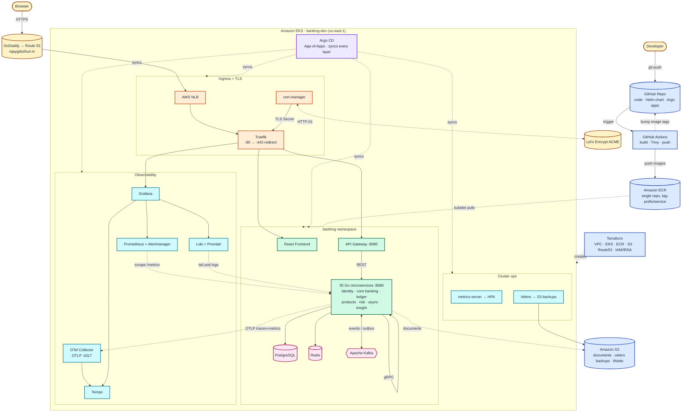
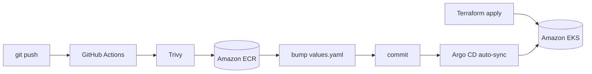

# Banking Platform on Amazon EKS

[](.github/workflows)
[](https://go.dev)
[](https://react.dev)
[](https://grpc.io)
[](https://kafka.apache.org)
[](https://kubernetes.io/)
[](https://argo-cd.readthedocs.io)
[](https://www.terraform.io)
[](https://opentelemetry.io)
[](LICENSE)

> A production-grade, enterprise-style **banking platform** built as **30 Go
> microservices** + an API gateway + a React frontend, deployed on **Amazon EKS**
> via **GitOps**, with a **double-entry ledger**, **gRPC** internals, **Kafka**
> event streaming, and a full **observability / security / backup** baseline.

This is a **learning / portfolio reference project**. It intentionally
**self-hosts its data stores (PostgreSQL, Redis, Kafka) in-cluster** rather than
using managed AWS data services, uses **Traefik** for ingress, and is served on
a real domain over HTTPS (`https://vijaygiduthuri.in`).

---

## What it is

- **30 backend microservices + an API gateway**, written in **Go 1.25** (Gin for
  REST). Each service listens on `:8080` and exposes `/healthz`, `/readyz`,
  `/startupz`, and `/metrics`, with structured JSON logs carrying a `trace_id`.
- **React frontend** SPA served by nginx (Register / Login / Accounts / Deposit /
  Transfer / Cards / Loans / Dashboard).
- **Three comms styles:**
  - **REST** — client ⇄ API gateway ⇄ services
  - **gRPC** — internal service-to-service (e.g. `account`/`transaction` → `ledger`),
    contracts generated from `proto/` (buf)
  - **Kafka** — async events via a **transactional outbox** (e.g. a deposit emits
    an event consumed by statement / audit / fraud)
- **Correctness patterns:** a **double-entry ledger** (every transaction is a
  balanced set of DEBIT/CREDIT entries), a **transactional outbox** for reliable
  event publishing, and **idempotency keys** on money operations.
- **Backed by** PostgreSQL (single shared DB, per-service table prefixes),
  **Redis** (cache/sessions), **Kafka** (event bus), and **S3** (documents).
- **OpenTelemetry** everywhere: traces → **Tempo**, metrics → **Prometheus**,
  logs → **Loki**, all correlated in **Grafana** (click a log's `trace_id` → jump
  straight to the trace).
- Shipped to **EKS** (`us-east-1`) through **GitHub Actions → ECR → Argo CD**,
  with **HTTPS** (Let's Encrypt), **HPA autoscaling**, and **Velero** backups.

---

## Architecture



**Legend**

| Colour | Category | Components |
|---|---|---|
| 🟡 Amber  | External actors      | Developer, Browser, Let's Encrypt, GoDaddy→Route 53 |
| 🔵 Blue   | Source / CI / Infra  | GitHub Repo, GitHub Actions, Amazon ECR, Terraform, S3 |
| 🟣 Purple | GitOps controller    | Argo CD (App-of-Apps) |
| 🟠 Orange | Ingress + TLS        | AWS NLB, Traefik, cert-manager |
| 🟢 Green  | Application          | React frontend, API gateway, 30 Go microservices |
| 🩷 Pink   | Data stores          | PostgreSQL, Redis, Kafka |
| 🔷 Cyan   | Observability + Ops  | OTel Collector, Prometheus/Grafana/Alertmanager, Loki, Tempo, metrics-server, Velero |

- **Infrastructure (Terraform).** `terraform/environments/dev` provisions VPC,
  **EKS** (+ EBS CSI add-on), **ECR** (single repo, tag-prefix per service), **S3**,
  **Route 53** (apex zone), and **IAM/IRSA** — state in S3 with native locking.
- **CI (GitHub Actions).** On push to `main`: build all 32 images in parallel,
  **Trivy** scan, push to ECR, then bump each service's image tag in
  `deploy/helm/banking-platform/values.yaml` and commit — **no `helm`/`kubectl` in CI.**
- **CD (Argo CD + Helm).** Argo CD's **App-of-Apps** renders the umbrella chart
  and reconciles every layer: the app, cluster storage (gp3), cert-manager,
  observability, metrics-server, and Velero.
- **Ingress + TLS.** One **AWS NLB** → **Traefik**, path-routed on the single apex
  host; **cert-manager** auto-issues/renews a Let's Encrypt cert (HTTP-01).
- **Data plane.** REST via the gateway; **gRPC** for internal calls (→ ledger);
  **Kafka** for async events via a **transactional outbox**; **Redis** cache;
  **S3** for documents.
- **Observability.** Services export **OTLP** to the **OTel Collector** →
  **Tempo** (traces); **Prometheus** scrapes `/metrics`; **Promtail** ships logs
  to **Loki**; **Grafana** ties all three together with a **per-service dashboard**.

See [`docs/aws/`](docs/aws/) for the full phase-by-phase deployment guide (01–08).

---

## Key engineering patterns

| Pattern | Where | Why |
|---|---|---|
| **Double-entry ledger** | `ledger-service` (gRPC) | Every money movement is a balanced set of DEBIT/CREDIT entries — the source of truth for balances. |
| **Transactional outbox** | `transaction-service` → Kafka | Events are written in the same DB tx as the state change, then relayed to Kafka — no lost/duplicate events. |
| **Idempotency keys** | deposits / withdrawals / transfers | Safe retries — the same key replays the original result instead of double-posting. |
| **gRPC internals** | `account`/`transaction` → `ledger` | Typed, fast service-to-service contracts generated from `proto/`. |
| **OTel correlation** | shared `pkg/telemetry` | One `trace_id` flows through logs (Loki), metrics, and traces (Tempo). |
| **Shared platform kit** | `pkg/` | config, logger, telemetry, http/grpc servers, kafka, redis, postgres, s3, auth (JWT), outbox, money — reused by all services. |

---

## The 30 microservices (+ gateway & frontend)

| Domain | Services |
|---|---|
| **Identity & access** | `auth` · `authz` · `customer` · `profile` · `kyc` · `document` |
| **Core banking + ledger** | `account` · `ledger` · `transaction` · `payment` · `beneficiary` · `wallet` |
| **Products** | `card` · `loan` · `emi` · `fixed-deposit` · `recurring-deposit` · `investment` · `currency-exchange` |
| **Risk, async & notifications** | `fraud` · `audit` · `notification` · `email` · `sms` |
| **Insight, ops & support** | `reports` · `analytics` · `search` · `statement` · `support` · `admin` |
| **Edge** | `api-gateway` · `frontend` (React) |

---

## Running on EKS

Live snapshot of the `banking` namespace — **35 pods** (30 microservices +
api-gateway + frontend + PostgreSQL + Kafka + Redis), all `Running`:

```text
$ kubectl -n banking get pods
NAME                                                   READY   STATUS
account-service-deployment-…                           1/1     Running
admin-service-deployment-…                             1/1     Running
analytics-service-deployment-…                         1/1     Running
api-gateway-deployment-…                               1/1     Running
audit-service-deployment-…                             1/1     Running
auth-service-deployment-…                              1/1     Running
authz-service-deployment-…                             1/1     Running
beneficiary-service-deployment-…                       1/1     Running
card-service-deployment-…                              1/1     Running
currency-exchange-service-deployment-…                 1/1     Running
customer-service-deployment-…                          1/1     Running
document-service-deployment-…                          1/1     Running
email-service-deployment-…                             1/1     Running
emi-service-deployment-…                               1/1     Running
fixed-deposit-service-deployment-…                     1/1     Running
fraud-service-deployment-…                             1/1     Running
frontend-deployment-…                                  1/1     Running
investment-service-deployment-…                        1/1     Running
kafka-0                                                 1/1     Running
kyc-service-deployment-…                               1/1     Running
ledger-service-deployment-…                            1/1     Running
loan-service-deployment-…                              1/1     Running
notification-service-deployment-…                      1/1     Running
payment-service-deployment-…                           1/1     Running
postgres-0                                             1/1     Running
profile-service-deployment-…                           1/1     Running
recurring-deposit-service-deployment-…                 1/1     Running
redis-…                                                1/1     Running
reports-service-deployment-…                           1/1     Running
search-service-deployment-…                            1/1     Running
sms-service-deployment-…                               1/1     Running
statement-service-deployment-…                         1/1     Running
support-service-deployment-…                           1/1     Running
transaction-service-deployment-…                       1/1     Running
wallet-service-deployment-…                            1/1     Running
```

Platform components run in their own namespaces — `traefik`, `argocd`,
`cert-manager`, `observability` (Prometheus/Grafana/Alertmanager, Loki, Tempo,
OTel Collector), `velero`, and `kube-system` (EBS CSI, metrics-server).

### Live URLs (single apex host, path-routed, HTTPS)
```
https://vijaygiduthuri.in/              🏦 app (React)
https://vijaygiduthuri.in/api           REST API (gateway)
https://vijaygiduthuri.in/argocd/       🚀 Argo CD
https://vijaygiduthuri.in/grafana/      📊 Grafana (metrics · logs · traces)
https://vijaygiduthuri.in/prometheus/   📈 Prometheus
https://vijaygiduthuri.in/alertmanager/ 🚨 Alertmanager
```

---

## Tech stack

| Layer | Technology |
|---|---|
| Backend services | **Go 1.25** — Gin (REST), gRPC (internal), Prometheus client, OTel SDK, structured JSON logging |
| Contracts | Protobuf / **gRPC** (`proto/`, buf-generated) |
| Frontend | **React 18 + Vite**, served by nginx |
| Database | **PostgreSQL** — single shared DB, per-service table prefixes, goose migrations |
| Cache | **Redis 7** |
| Messaging | **Apache Kafka** (event bus) + transactional outbox |
| Object storage | **Amazon S3** (documents, Velero backups, Terraform state) |
| Orchestration | **Amazon EKS** (`us-east-1`), managed node group (t3.xlarge) |
| Ingress / TLS | **AWS NLB → Traefik** + **cert-manager** (Let's Encrypt) |
| DNS | **Route 53** apex ALIAS (GoDaddy delegates nameservers) |
| GitOps | **Argo CD** (App-of-Apps) |
| Packaging | **Helm** umbrella chart (`deploy/helm/banking-platform/`) |
| IaC | **Terraform** (`terraform/` — vpc, iam, eks, ecr, s3, route53; optional velero) |
| CI/CD | **GitHub Actions** — matrix build, Trivy scan, ECR push, values bump |
| Metrics | **Prometheus** (kube-prometheus-stack) + **Grafana** |
| Logs | **Loki + Promtail** |
| Traces | **Tempo** via the **OpenTelemetry Collector** (OTLP) |
| Autoscaling | **metrics-server** + **HPA** (per service) |
| Backup / DR | **Velero** → S3 (file-system backups, daily schedule) |
| Security scan | **Trivy** (CI, report-only) |

---

## Repository layout

```
banking_application_eks/
├── services/            # 30 Go microservices + api-gateway (one module each)
├── pkg/                 # shared kit: config, logger, telemetry, http/grpc servers,
│                        #   kafka, redis, postgres, s3, auth (JWT), outbox, money, …
├── proto/               # protobuf / gRPC contracts (buf)
├── frontend/            # React SPA (Vite + nginx)
├── build/               # shared service Dockerfile
├── deploy/
│   ├── helm/banking-platform/   # umbrella Helm chart (per-service YAML + flat values)
│   ├── argocd/                  # App-of-Apps: bootstrap/ + apps/ (+ observability/)
│   ├── cluster/                 # gp3 StorageClass, cert-manager ClusterIssuer
│   └── observability/           # Prometheus/Grafana/Loki/Tempo/OTel values + dashboards
├── terraform/
│   ├── modules/         # vpc · iam · eks · ecr · s3 · route53 · velero
│   ├── environments/    # dev · qa · prod (dev is used here)
│   └── velero/          # standalone, optional Velero stack (own state)
├── docs/aws/            # 01–08 phase-by-phase deployment guides
├── .github/workflows/   # ci.yaml (build→ECR→bump) · terraform.yaml
└── README.md
```

---

## Deployment overview



Follow the guides in order — [`docs/aws/`](docs/aws/):

1. **[01](docs/aws/01-terraform-infra.md)** — Terraform: VPC, EKS (+EBS CSI), ECR, S3, Route 53
2. **[02](docs/aws/02-traefik-ingress.md)** — Traefik ingress (AWS NLB)
3. **[03](docs/aws/03-github-actions-cicd.md)** — CI/CD → ECR
4. **[04](docs/aws/04-argocd.md)** — Argo CD App-of-Apps bootstrap
5. **[05](docs/aws/05-dns-godaddy.md)** — DNS: apex via Route 53 (GoDaddy delegation)
6. **[06](docs/aws/06-observability.md)** — Prometheus/Grafana/Loki/Tempo/OTel + metrics-server (HPA)
7. **[07](docs/aws/07-https-tls.md)** — HTTPS/TLS (cert-manager + Let's Encrypt)
8. **[08](docs/aws/08-velero.md)** — Backup & DR with Velero

---

## Local development (docker-compose)

Run the whole stack (services + Postgres + Redis + Kafka) locally:

```sh
docker compose -f docker-compose.yaml up --build
```

---

## Observability at a glance

- **Grafana → "Banking — Service Detail (per service)"** — pick any service from a
  dropdown to see its **running pods, request rate, p50/p95/p99 latency, CPU,
  memory, and live logs**.
- **metrics ↔ logs ↔ traces:** click a log line's `trace_id` in Loki → jump to the
  full request trace in Tempo.
- **HPAs** scale each service on CPU/memory (backed by metrics-server).

---

## License

**Banking Platform — Personal & Educational Use License** — see [LICENSE](LICENSE).

| | |
|---|---|
| ✅ **Free, no permission needed** | Clone, fork, run on your own laptop / cloud account for personal study. Modify for your own non-commercial use. Reference the architecture in your own work, with attribution. |
| ❌ **Permission required** | Videos / screencasts / paid courses / tutorials featuring this project. Books or paid newsletters copying the code or docs. Any commercial reuse (selling, re-hosting as a paid service). |
| 📩 **Want to make educational content?** | Email **vijaygiduthuri67@gmail.com** with who you are, what you'll make, where you'll publish, and whether it's paid or free. Educational creators with clear attribution are welcome. |

This project was built as a learning artifact for **cloud / DevOps / platform / SRE
engineers** and stays free for that purpose. The restriction is on repackaging it
as your own content — not on you learning from it.

> Note: this is a **source-available** license, not an OSI-approved open-source license.
